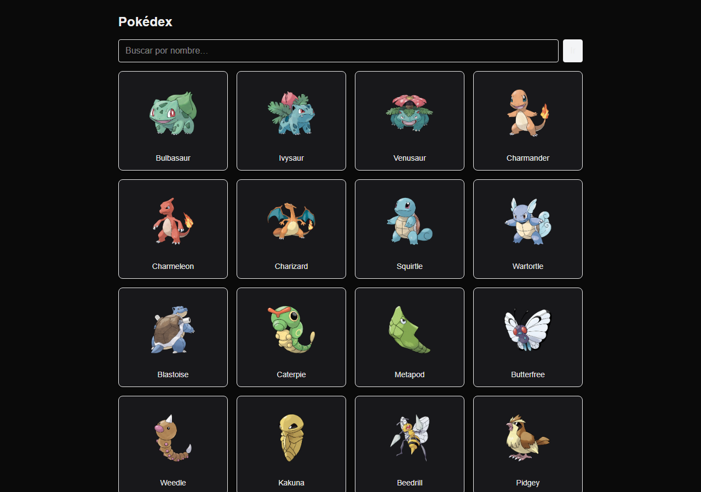
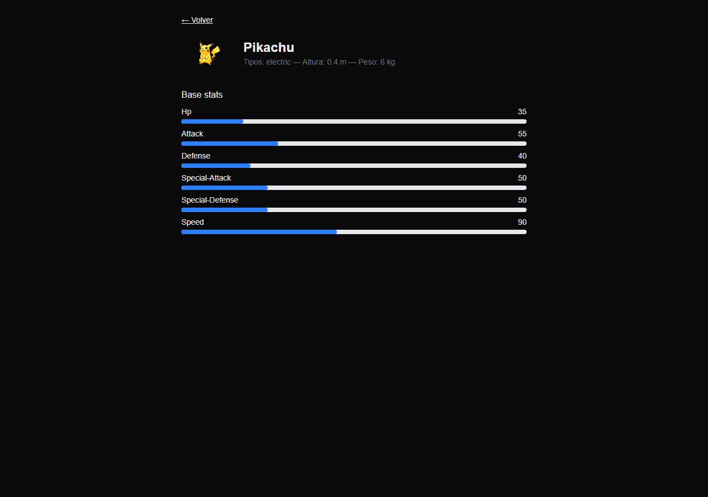

# Mini Pokédex

A first-generation Pokédex built with **Next.js (App Router)** that fetches data from the public [PokéAPI](https://pokeapi.co/) using React Server Components.

> 🇦🇷 Pokédex de la primera generación hecha con Next.js, TypeScript y Tailwind, consumiendo la PokéAPI.

**Live demo:** _coming soon (Vercel)_




## Tech stack

- [Next.js 16](https://nextjs.org/) (App Router, Server Components)
- React 19 + TypeScript
- Tailwind CSS 4
- ESLint

## Features

- Paginated list of the first 151 Pokémon (20 per page), with the page kept in the URL (`/pokedex?page=2`)
- Detail page per Pokémon (`/pokedex/[name]`) with sprite, types, height, weight and base stats rendered as bars
- Search by name that goes straight to the detail page
- Data fetched on the server with `fetch` and cached with `revalidate: 60`
- Route-level `loading.tsx` and `error.tsx` states
- Fallback image when an artwork sprite is missing

## Project structure

```
app/
├── lib/pokeapi.ts          # Typed PokéAPI client (list + detail)
├── components/             # Card, search, pagination, stats bar
├── pokedex/page.tsx        # List page (server component)
└── pokedex/[name]/page.tsx # Detail page (server component)
```

## Getting started

Requires Node.js 20+.

```bash
npm install
npm run dev
```

Open http://localhost:3000. No environment variables are needed.

```bash
npm run build   # production build
npm start       # serve the production build
```

## What I learned

- Splitting a page into **server components** for data fetching and small **client components** (`"use client"`) only where interactivity is needed (search, pagination).
- Using the URL (`searchParams`) as the source of truth for pagination state instead of local state.
- Handling async route `params` in Next.js 16 and adding `loading` / `error` boundaries per route.

## License

[MIT](LICENSE)
